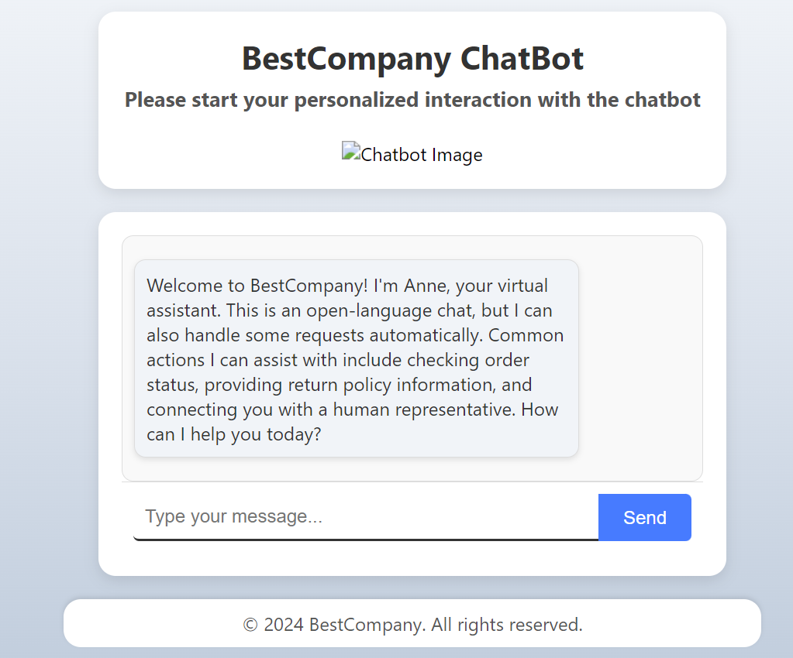

## 07.2024

<table>
  <tr>
    <td>
      
    </td>
  </tr>
</table> 

# Project Title: Intelligent Interactive System - Final Design Project : SpeechUp

## Description

in this project, we aim to address a particularly timely issue - Israeli advocacy and responding to expressions of antisemitism on social media. Our system will enable various users, regardless of their level of articulation, language barriers, and experience, to create high-quality and relevant texts that increase exposure to Israeli advocacy. The solution we propose is an intelligent system that supports a variety of functions, including:

## Features
